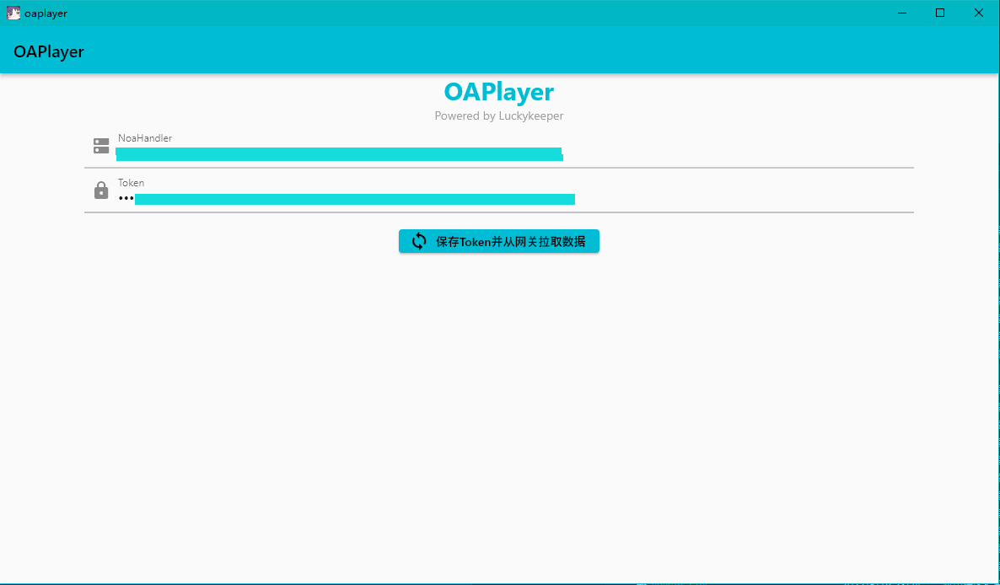
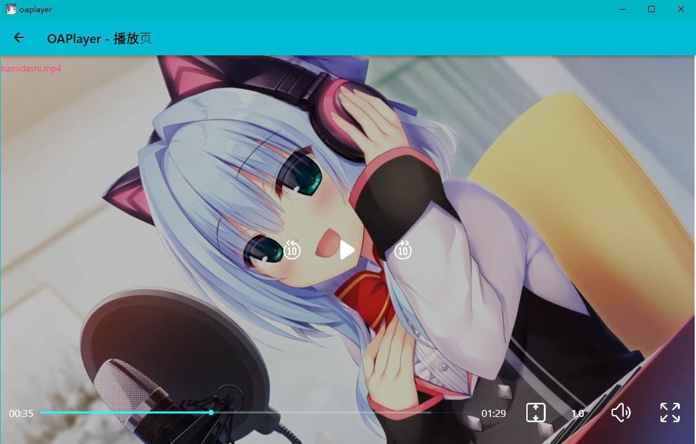

# OAPlayer
Flutter 练手小工具，一个视频播放器，连续播放列表中的视频（从网络源获取），适合白嫖网络免费存储听OP/ED

> 注意：需要搭配 OADrive（采集-可选）和 NoaHandler（网关-必选）使用

## 使用

NoaHandler 网关实现以下接口即可使用（NoaHandler 没有开源，自己实现以下接口即可使用这个小工具，把自己实现的接口和 Token 填写上去即可使用）

> NoaHandler 网关需要注意填写时不带协议，仅支持 https
>
> e.g. NoaHandler 接口为 `https://www.example.com:443/oaPlayer` 则填写 `www.example.com:443/oaPlayer` 支持非标端口

### 请求数据（OAPlayer 侧向 NoaHandler 发送）

请求方式：`POST`

```go
type UshioNoaAppRequest struct {
	Token      string `json:"token"`      // 验证 token
}
```

### 返回数据（NoaHandler 侧向 OAPlayer 返回）

```go
type OAPlayerMsg struct {
	StatusCode   int                    `json:"statusCode"` // 结果码
	StatusString string                 `json:"StatusString"` // 操作结果（文本说明）
	VideoList    []OAPlayerMsgVideoInfo `json:"VideoList"` // 视频列表
}

type OAPlayerMsgVideoInfo struct {
	VideoName string `json:"videoName"` // 视频名称
	VideoUrl  string `json:"videoUrl"`  // 视频链接
}

```

## 截图




